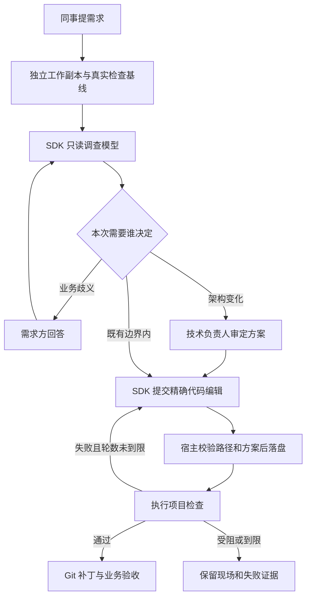

# Team Product Agent

[](https://github.com/JeasonKim/team-product-agent/actions/workflows/ci.yml) · [MIT License](LICENSE)

在 Mac 上运行的团队产品研发 Agent。团队成员通过飞书提需求，服务调查现有仓库、处理业务澄清和架构决定、生成代码改动、运行真实检查，并在限定轮数内修复。支持 Claude Agent SDK 与 Codex SDK。

当前交付边界是独立工作副本、可应用的 Git 补丁、验证记录和业务验收。合并与部署沿用项目现有流程。

## 能做什么

- 产品、运营在飞书单聊或群聊中直接提需求，用普通语言补充和验收。
- 根据任务上下文识别新需求与历史补充；不确定时列标题供选择。
- 通过 Codex SDK 或 Claude Agent SDK 调查和实现，在独立副本中循环检查、修复。
- 用状态泳道追踪需求，查看在线状态、模型、推理级别、执行证据和补丁。
- 业务问题找需求方，架构方案和执行异常找负责人；项目经验经过独立对比评估再启用。

当前面向可信团队的小范围试用，运行平台为 macOS。Claude 适配器具备协议测试；真实账号效果需要使用自己的 API Key 联调。

## 本地启动

需要 Node.js 22.12+、PNPM 10.11 和 Git。依赖和两套 SDK 已锁定在 `pnpm-lock.yaml`；Codex 使用随 SDK 安装的 0.158.0 运行时，不依赖全局 Codex 版本。

```bash
git clone https://github.com/JeasonKim/team-product-agent.git
cd team-product-agent
# 使用 nvm 时先执行 nvm install && nvm use
pnpm install --frozen-lockfile
pnpm build
pnpm start init /你的产品Git仓库
cp .env.example .env
```

编辑 `agent.config.json` 和本机 `.env`：

- `repository` 是要修改的产品仓库；任务从已提交的 HEAD 创建独立 Git 副本。原仓库的未提交内容不进入任务。
- `engine` 设为 `codex` 或 `claude`。`models`、`efforts` 可分别指定两个引擎的模型与推理级别；留空时使用各自运行时默认值。做可复现评估时请固定模型。
- `setup` 是副本环境准备命令，例如 `pnpm install --frozen-lockfile`。`checks` 必须换成该产品真实有效的检查，支持 Spring 项目的 `./mvnw test` 等命令。
- `ownerIds` 放技术负责人飞书 `open_id`；保留 `local-owner` 可从本机 CLI 管理。`requesterIds` 放获准试用的同事；`chatIds` 绑定项目聊天。
- `sensitivePaths` 是需要负责人审定的精确文件或目录前缀，目录以 `/` 结尾。按产品补充数据库、公共契约和权限配置路径。
- 默认在 `.env` 提供所选引擎的 API Key。Codex 可显式设置 `authentication.codex` 为 `local_login`，复用本机 `codex login` 的登录；不提取或复制 OAuth token，也不在缺少 API Key 时静默切换到个人登录。认证方式随项目进入任务快照。
- 当前 Claude 适配器使用 `ANTHROPIC_API_KEY`，未接入 Claude 订阅登录。凭证留在本机，不进入飞书、工作副本或角色提示词。

配置文件相对路径以配置文件所在目录为基准。命令使用参数数组，不经过 shell；`checks` 和 `setup` 只能由本机负责人配置。

配置完成后，平时只需：

```bash
# 终端一：启动飞书机器人、执行队列和后台
pnpm serve

# 终端二：在浏览器打开后台，自动使用当前访问令牌
pnpm admin
```

终端一保持运行，按 `Ctrl+C` 停止；Mac 需要在线且不休眠。后台地址为 `http://127.0.0.1:4318`，初次访问和服务重启后请用 `pnpm admin` 打开。这里的命令为前台启动，不会安装开机自启服务。

先不接入飞书时，用 `pnpm start serve` 启动本机后台，或通过 CLI 试用：

```bash
pnpm start doctor
pnpm start submit product "修复列表筛选后翻页异常"
pnpm start run
pnpm start status
```

`run` 执行当前可推进队列后退出；`serve` 持续运行。任务需要人回应时持久化等待，不持续占用模型推理。运行中的任务保留角色、Skill、项目配置、SDK 与 Node 版本记录。

## 本机管理后台

`pnpm serve`（等同于 `pnpm start serve --feishu`）同时启动执行队列、飞书连接和后台，默认只监听 `127.0.0.1:4318`；可用 `--port` 调整端口。完整访问链接保存在数据目录的 `admin.url`，服务每次启动更新令牌。运行 `pnpm admin` 会检查服务是否可用并打开这个链接，无需复制令牌；也可以手动打开文件中的链接。不要把带令牌的链接转发给同事。后台不是团队公共入口，同事使用飞书。

后台包含：

- 总览：待负责人审定的方案、失败任务、新成员接入申请和发送失败的通知。
- 需求详情：原始需求、反馈、方案、身份与模型快照、SDK 运行、真实检查输出、补丁下载、过程与通知送达记录；支持回应、调整、取消和重试。
- 需求看板：按待执行、进行中、等待回复、待验收、需要协助、已结束分列；支持搜索、产品/状态筛选、泳道跳转和卡片详情。卡片显示任务实际配置的引擎、模型与推理级别，等待中的任务注明由需求方还是负责人处理。
- Agent 设置：职责、风格、长期偏好，分别配置 Codex / Claude 的模型、推理级别和认证方式，产品权限、仓库与固定检查。Codex 候选模型来自本机原生缓存，也可手填；级别列表不保证账号模型的实际可用性。
- 经验与成长：从真实任务提炼候选，运行独立对比评估，按证据启用或停用。稳定的个人偏好可直接写入身份设置。

设置经校验后原子写回配置文件，并记录变更前后内容。多个页面的陈旧保存和陈旧待决操作会被拒绝；运行中在后台之外修改配置文件，需要重启服务加载。模型与身份新默认值不会改写已创建任务的快照。后台令牌放在 URL fragment 中，加载后移除并存入页面会话，API 校验令牌、Host 和 Origin；密钥不在页面或设置接口中传输。

看板顶部显示执行服务是否在线、飞书连接、各产品的新需求默认配置，以及进行中/待办数量。待办包括待执行、等待回复、待验收和需要协助。每 10 秒刷新；心跳过期或后台连接失败时不继续显示在线，保留的旧记录会明确标注。在线指本机执行服务有心跳，模型调用是否成功以实际任务记录为准。

## 接入飞书

创建或选用飞书企业自建应用，开启机器人能力，申请接收机器人消息与发送消息所需权限，订阅 `im.message.receive_v1`，选择长连接接收事件并发布给试用成员。具体权限名称以飞书控制台对应事件和接口的要求为准。

两种接入方式共用任务队列和消息去重：已有 lark-cli 应用时，在 `.env` 设置 `FEISHU_CLI_PROFILE` 和 `FEISHU_BOT_OPEN_ID`，由 CLI 管理凭证与事件订阅；要求 CLI 1.0.80+，多版本共存时设置 `FEISHU_CLI_PATH`。否则配置 `FEISHU_APP_ID`、`FEISHU_APP_SECRET` 和 `FEISHU_BOT_OPEN_ID`，使用 Node SDK 长连接。项目配置中填写真实人员和聊天 ID。Mac 需保持在线、服务运行且不休眠。

```bash
pnpm serve
```

同事可以直接单聊机器人，用普通语言描述需求。可访问多个产品时首次列名称供选择，之后记住；说“切换产品”可以更换。未获授权的同事会形成接入申请，负责人从后台选择产品授权后，原请求自动继续。

也可以直接问“你在线吗？”“使用什么模型和推理级别？”“目前有什么待办任务？”。常用查询由宿主即时读取服务和任务状态，不调用模型、不新建任务，也不清空尚未完成的会话选择。其他表达可由会话识别器提出概览意图，实际数据仍由宿主提供。回复包括引擎类型、模型、推理级别、任务计数及未结束任务的标题；普通成员只看到自己的任务，负责人看到所负责产品的全部任务。群内查询限定绑定产品，清单通过单聊返回。服务完全停止时机器人无法回话，需要在本机检查服务。

也可以在绑定项目的群中 @ 机器人；其他群消息不会触发任务。默认群里只提示一次收件，后续调查、澄清与交付发给提出者的单聊。后台可改为群里保留关键结果或在群中继续。通知方式随任务固定，旧任务保留原来的通知渠道。目前接收文本需求。

有业务歧义时，机器人找需求方；涉及架构或执行恢复时，向负责人单聊发送具体方案；执行失败也会通知负责人，需求者收到正在等待协助的说明。日常对话不需要任务号或待决编号：

```text
价格保留两位小数。
另外，订单按创建时间从新到旧排。
价格那个再加上人民币符号。
好的，就按这个方案做。
订单排序现在做到哪了？
取消订单排序这个需求。
```

机器人用所选项目的 SDK 识别新需求、历史补充、业务回答、确认和进度询问，参考对话和各任务的当前状态。拿不准时列出简短标题，让用户回复“第二个”或“2”。选择记录按项目、聊天和发送人保存，重启后仍可接上；30 分钟后或方案变化时失效。也可以引用机器人消息指定会话，或用“新需求：…”明确另起一件事，这个明确意图由宿主直接处理，不再让模型改判为历史补充。

模型只能提出路由建议。宿主核对人员身份、任务范围、当前方案和问题的实际送达时间；带条件、否定或疑问的文字不能作为同意。多个待确认方案遇到无明确目标的“同意”会先列标题，旧消息不能批准新方案。识别失败时保留记录并请用户选会话，不会把异常当作新任务。

补充会回到原任务，已完成的需求也可继续。宿主让旧待决失效、保留历史代码和证据、重新规划；执行中的旧运行会停止。另一个用户不能借用你的选择记录或通过文字自称负责人。兼容旧格式命令，日常使用无需记住它们。

飞书回调只持久化消息并快速返回。消息 ID 去重，业务状态与发件记录使用 SQLite 事务；发件使用固定 UUID 重试。连续投递失败会保留记录，`doctor` 和管理后台可查看，后台支持重新发送。服务仅允许一个工作进程执行任务。

## 研发与介入流程



两套引擎都使用 [角色定义](resources/agent-role.md) 和打包的 [verify-and-improve](resources/skills/verify-and-improve/SKILL.md)。Skill 主体与 Agent 体验验证指引作为任务快照加载；检查、失败回传和停止条件由宿主执行。

Agent 在只读环境中返回结构化编辑：现文件中的唯一原文、替换文本、新建或删除文件。宿主检查批准范围、保留路径、符号链接及原文匹配，再落盘。支持新增、修改、删除和多文件变更；单文件最大 2 MB，一个批次每个文件一个编辑。二进制文件和直接执行任意终端操作不属于此版编辑协议。

Codex 使用命名只读权限配置：仅最小系统路径和当前工作副本可读，命令网络关闭；启动器忽略个人配置和执行规则，关闭插件、连接器、hooks 和子 Agent。Claude 使用显式只读工具与路径检查，关闭个人／项目设置和外部 MCP。角色、授权及 SDK 成功状态均不能替代真实检查。

项目的准备与检查命令由本机服务执行，权限属于当前 Mac 用户。因此本版适用于负责人信任的仓库和团队试用；工作副本不构成针对任意恶意测试脚本的操作系统隔离。

架构语义仍需模型分析和负责人审定，路径规则不能证明所有架构变更都已被识别。项目检查的覆盖范围由实际配置决定；页面预览、浏览器验收和发布方式需随具体产品接入。

## 恢复、切换与证据

```bash
pnpm start status 任务号
pnpm start reply 任务号 待决编号 approve
pnpm start cancel 任务号
pnpm start retry 任务号
pnpm start engine 任务号 claude
```

重启发现执行中断时，会请求负责人核对现场。取消会通知 SDK 和检查进程停止，保留副本。SDK、执行命令、仓库、授权边界变化或收回成员权限时重新确认并规划；增加成员不会中断其他任务。修改模型、推理级别和协作身份只影响新需求。切换引擎会保留业务需求、决定、代码和证据，清除旧引擎会话引用并创建新执行记录。

数据位于配置的 `dataDirectory`：

- `agent.sqlite`：任务、决定、执行、验证、收发件、会话上下文、消息引用、路由证据、接入申请、审计、经验候选和评估队列。启动时事务性升级旧版数据；版本 3 数据库不能直接交给旧版程序运行，回退时应使用升级前备份。
- `tasks/<任务号>/workspace`：独立 Git 工作副本。
- `tasks/<任务号>/delivery-*.patch`：可用 `git apply --check` 检查的补丁。
- `evaluations/<评估号>/`：基线／候选试验、独立验收结果和评估报告。

原生 SDK 会话由各自运行时保存，会话 ID 随任务持久化。备份服务数据、SDK 会话和产品仓库时需一并考虑；只有数据库不能恢复丢失的原生会话。启动前创建副本期间的异常可能留下不完整目录，需负责人核对后恢复或重新提交。

检查日志保留最后 80000 字符并记录是否截断；补丁超出输出限制会失败，不能截断交付。当前固定 Codex 运行时的 token 数实测为会话累计值，以 `usage.scope=session` 标注；统计多轮成本时按会话去重，不能逐轮直接相加。缓存输入单独记录。Codex 未提供的费用和 Claude 恢复会话无法可靠拆分的费用记为未知。

## 跨任务改进

Agent 可以从交付中形成经验候选；负责人也可以从失败记录整理候选文件：

```bash
pnpm start candidates
pnpm start candidate 任务号 ./lesson.md
pnpm start evaluate 候选号 ./evaluation.json
pnpm start promote 候选号 评估编号
```

`evaluation.example.json` 展示场景格式。使用真实普通需求，包含回归和独立保留场景。交付场景必须提供独立验收命令，该命令不进入被测 Agent 的任务输入。

评估默认真实调用该产品当前选择的引擎，分别运行现行经验与候选经验，每组使用两个独立任务重复验证，即每个场景每个引擎执行 4 个任务。Codex 可使用明确配置的本机登录；Claude 仍需 API Key。评估消耗所选引擎额度，不要求同时具备两套凭证。评估要求候选场景重复验证全部通过、没有旧场景退化、至少存在一次通过率改善。负责人晋升时再次检查候选、角色、项目、代码、运行时和经验基线版本；新经验仅进入已验证引擎的后续任务。

后台支持从任务保存候选、排队评估、查看对比报告、停止评估、启用和停用经验。产品设置中的 `evaluationManifest` 指定独立场景文件；设置 `autoEvaluate: true` 后，业务验收完成的需求所产生的候选自动评估，每个候选自动入队一次、最多同时执行一组，失败不会自动无限重试。观察到改善后通知负责人决定是否启用。评估中断时保留试验并标记中断。日常需求与评估使用独立工作副本。

本版晋升的是项目经验文本。修改工具代码、角色或权限政策仍属于显式研发变更。评估没有通过时保留候选，不自动扩权或修改验收标准。

## 验证

```bash
pnpm check
pnpm exec node scripts/verify-conversations.mjs first
pnpm exec node scripts/verify-conversations.mjs repeat
pnpm exec node scripts/verify-conversations.mjs heldout
```

测试覆盖双引擎统一业务流程、人员权限、陈旧批准、重复收件、精确编辑、符号链接、真实 Git 副本与补丁、失败回归、取消、中断恢复、SDK 事件适配和经验晋升规则。Mac 上还运行随 SDK 安装的真实 Codex 沙箱，验证工作副本可读、外部文件及 `.env` 不可读、写入被拒绝。

后面三条命令使用本机 Codex 登录并实际消耗模型额度，在 `work/` 创建独立小店仓库。前两轮真实编码并独立检查价格、排序和历史补充，第三轮用预置历史状态检验不同自然说法。消息传输为本地模拟，结果与失败成本写入 `validation/`。SDK 事件单元测试使用协议替身；它们不代表真实模型输出质量。个人账号试验记录、聊天标识和任务数据不包含在公开仓库中。

## 开发与数据

源码入口是 `src/cli.ts`，生命周期在 `src/service.ts`，业务契约在 `src/domain/`，SDK 和飞书适配器在 `src/adapters/`，本机后台在 `src/admin/` 与 `resources/admin/`。项目约定见 [AGENTS.md](AGENTS.md)。

修改后运行 `pnpm check`；开发调试可以使用 `pnpm dev serve`。更新到新代码后执行 `pnpm install --frozen-lockfile && pnpm build`，再重启服务。

`.env`、`agent.config.json`、默认数据目录、试验日志和本机验证截图均已排除在 Git 之外。备份或迁移时先停止服务，一并保留本机配置、数据目录、产品仓库和需要续接的 SDK 会话。历史记录含绝对路径，直接改目录后应保留旧路径兼容链接，或单独完成历史数据迁移；不应手工批量替换任务快照。

请勿在 Issue 中提交凭证、带令牌的后台链接或真实团队聊天记录。问题报告提供复现步骤、Node / SDK 版本和脱敏后的检查结果即可。

## 许可证

项目代码使用 [MIT 许可证](LICENSE)。所调用 SDK 和模型服务按各自条款使用。

## 官方接口依据

- [Claude Agent SDK](https://code.claude.com/docs/en/agent-sdk/overview)、[TypeScript API](https://code.claude.com/docs/en/agent-sdk/typescript)。
- [Codex SDK](https://learn.chatgpt.com/docs/codex-sdk)、[配置参考](https://learn.chatgpt.com/docs/config-file/config-reference)。
- [Codex 本机登录缓存](https://learn.chatgpt.com/docs/auth#login-caching)、[Claude SDK 认证要求](https://code.claude.com/docs/en/agent-sdk/quickstart)。
- [飞书 Node SDK](https://github.com/larksuite/node-sdk)。
