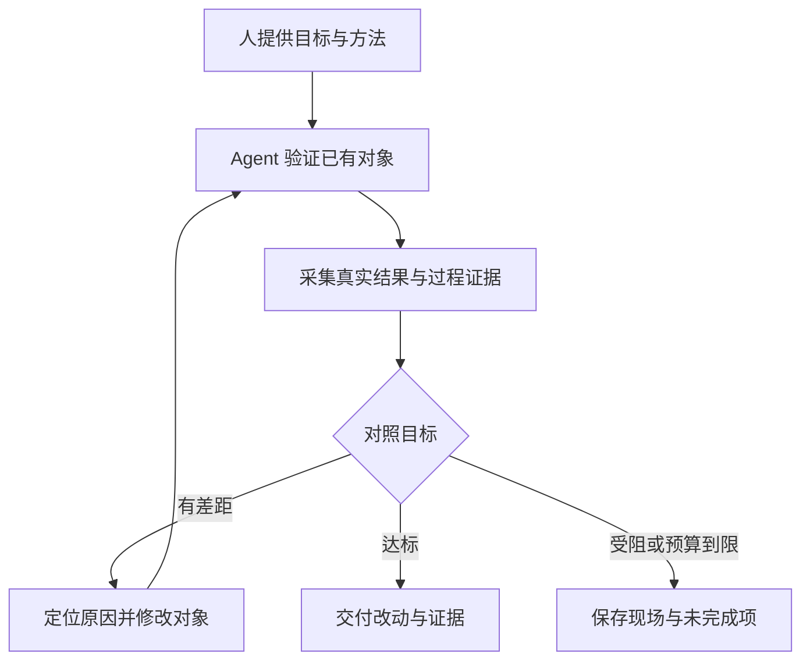

# 验证与改进

人提供行动目标与行动方法，Agent 根据真实反馈反复验证和改进已有对象，直至目标达成。

## 模型

| 元素 | 定义与关系 |
| --- | --- |
| 人 | 决定目标和方法；明确的信息直接沿用，只澄清会改变结果或边界的缺项。 |
| 改进 Agent | 执行闭环，补全测试策略，依据证据修改对象；不自行降低目标或扩大授权。 |
| 被测对象 | 已有功能、流程或 Agent 方案。对象中的被测 Agent 与负责改进的 Agent 职责分开。 |
| 目标 | 期望结果及达成判据，作为各轮比较的基准。 |
| 方法 | 测试途径、改动范围、必要约束与停止条件；允许 Agent 在范围内调整具体策略。 |
| 证据 | 实际产物、业务状态、执行记录及可获得的成本数据，用于判断目标与现状的差距。 |



## 执行闭环

1. **确定本次目标和方法。** 从用户要求与项目中整理对象、验收判据、代表场景、可改范围和执行入口，简短告知后推进。用户给出的预算、模型和授权直接采用；缺少会显著影响费用或外部写入的信息时只补问这些缺项，不要求用户填写完整测试规格。
2. **建立基线。** 先运行现状，保留失败与成本，再修改。优先复用项目脚本、API、CLI 或 IPC 驱动真实入口；界面体验仍操作真实控件验证。测试夹具与真实业务数据分离，必要模拟标明边界。
3. **验证、解释、改进。** 每轮围绕一个有证据的原因修改提示词、Skill、工具契约或代码。复测失败场景，再覆盖受影响的已有场景；保留改善，撤回自己引入的退化。修改 Skill 时使用环境中可用的 `skill-creator`。
4. **核验并继续。** 按目标检查真实结果；过程与成本按本次方法评估。随机性明显的路径用不同输入或重复试验确认稳定性，记录每次失败；不以反复重试后的偶然成功宣布完成。

目标涉及 Agent 对话、意图识别、工具选择或 token 效率时，读取 [Agent 体验验证](references/agent-experience.md)。

## 判定与停止

- 能用程序核验的结果优先用程序核验；模型评价用于语义与体验，结论附证据。进程退出成功、Agent 自称完成和模拟成功都不能直接替代业务验收；缺少证据标为未验证。
- 目标与验收语义保持稳定。验收器确有错误时修正并说明证据，保留新旧差异；不通过删场景、弱化断言、丰富被测输入或更换指定模型获得通过。
- 只在达成判据且必要回归通过时完成；遇到用户停止、真实外部阻碍或明确预算上限时保存现场，说明尚未达成。没有预算上限时以小批试验推进；连续试验没有新证据或改善时更换诊断途径，仍无可执行路径再说明阻碍，不无限重跑同一方案。
- 重复验证沿用已有授权。外部写入使用可识别的测试对象；响应不明确时先查实际状态，不能盲目重放。新增授权需求只阻止依赖它的步骤。

## 证据与交付

复用项目已有报告；没有时，在临时目录或项目专用验证目录保留简短的目标与方法、逐轮执行证据、改动依据和下一步，支持中断后续做。对照需记录被测版本、输入和运行配置；凭证不进入参数、日志或报告，缺失指标标明未知。

需要保存单次命令的输出、耗时和超时现场时，使用 [试验运行器](scripts/run_trial.py)：

```bash
python3 <skill-dir>/scripts/run_trial.py \
  --out /tmp/improvement-session/round-001 \
  --cwd /path/to/project --timeout-seconds 180 \
  -- <项目已有的验证命令及参数>
```

每次指定新的输出目录；脚本保留完整日志，失败时返回有限长度的日志片段，业务结论由项目验收证据决定。它在 macOS/Linux 上运行一次命令并回收该命令进程组，不承载模型调度或长期服务。

交付说明目标是否达成、关键改动、前后对照、证据位置及未验证范围。全部失败尝试保留在记录中；实现改进不能以修饰报告替代。
